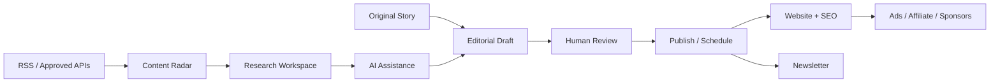
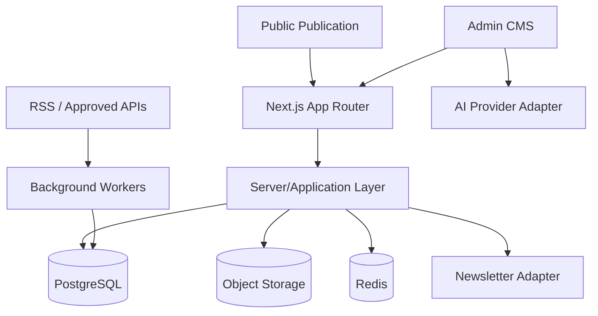

<div align="center">

# 📰 The Living Journal

### A human-led, AI-assisted technology publication

**Discover → Research → Edit → Publish → Distribute → Monetize**


A reusable Awwwards-inspired editorial frontend evolving into a production publishing platform for **AI, software, startups, products, careers, business and future technology**.

[Product Requirements](docs/PRD.md) · [Architecture](docs/ARCHITECTURE.md) · [Roadmap](docs/ROADMAP.md) · [ADR-001](docs/adr/ADR-001-nextjs-production-architecture.md) · [Phase 0 Plan](docs/PHASE-0-MIGRATION-PLAN.md)

</div>

---

## ✨ Product idea

The Living Journal is not an automated news scraper. It combines original publishing with a future **Content Radar** for RSS/approved APIs and an **AI Editorial Copilot** for research and drafting.

> **APIs discover. AI assists. Humans decide. The Journal publishes.**



---

## 🚦 Current status

| Phase | Scope | Status |
|---|---|---|
| V2 | Reusable editorial frontend + GSAP visual system | ✅ Complete |
| V2.1 | UI recovery, responsive/internal-page polish | ✅ Stable baseline |
| Phase 0 | **Next.js migration + production foundation** | 🟡 In progress |
| Phase 1 | Authentication + RBAC | ⬜ Planned |
| Phase 2 | Production CMS + media | ⬜ Planned |
| Phase 3 | Content Radar + RSS/API ingestion | ⬜ Planned |
| Phase 4 | AI Editorial Copilot | ⬜ Planned |
| Phase 5 | SEO + sitemap + RSS/distribution | ⬜ Planned |
| Phase 6 | Audience + newsletter | ⬜ Planned |
| Phase 7 | Monetization | ⬜ Planned |
| Phase 8 | Analytics + hardening + launch | ⬜ Planned |

### ✅ Phase 0 architecture decision is locked

We accepted [`ADR-001`](docs/adr/ADR-001-nextjs-production-architecture.md):

```text
Next.js App Router
      ↓
React + TypeScript
      ↓
Server/Application Modules
      ↓
PostgreSQL + Prisma
      ↓
Redis + BullMQ when durable jobs arrive
```

We are **not** adding a separate NestJS service in the initial production architecture. If future scale/team boundaries justify service extraction, that requires a new ADR.

The exact migration order and gates live in [`docs/PHASE-0-MIGRATION-PLAN.md`](docs/PHASE-0-MIGRATION-PLAN.md).

---

## 🎨 V2.1 — visual baseline

V2.1 is now the frontend reference that Phase 0 must preserve.

- ✅ Layered editorial landing page.
- ✅ Responsive header + mobile navigation.
- ✅ GSAP hero parallax, ticker and reveal motion.
- ✅ Stories, Categories, Story Detail and Search.
- ✅ Newsletter, About, Contact, Advertise, Legal and 404.
- ✅ Admin dashboard/posts/editor/audience/settings demo UI.
- ✅ Mobile/narrow layouts.
- ✅ Safe demo `localStorage` behavior.
- ✅ `prefers-reduced-motion` support.

### Styling baseline

```text
src/styles/
├── tokens.css      # design tokens
├── global.css      # structural/base rules
└── polish.css      # V2.1 detailed route/responsive styling
```

**Phase 0 rule:** do not redesign these surfaces while migrating the runtime. Any visual change must be a compatibility fix or separately approved improvement.

---

## 🧱 Accepted production architecture



### Why this direction

- Stronger SEO/crawlable article rendering.
- Dynamic metadata, sitemap and RSS fit naturally.
- Existing React components remain reusable.
- One application boundary keeps early production simpler.
- Server-side auth/data/provider code can stay isolated from client code.
- Background workers can still run separately when BullMQ arrives.

Deep details: [`docs/ARCHITECTURE.md`](docs/ARCHITECTURE.md).

---

## 🚧 Phase 0 migration sequence

```text
0A Freeze V2.1 baseline
        ↓
0B Migrate routes/runtime to Next.js
        ↓
0C Stabilize GSAP + client/SSR boundaries
        ↓
0D Add PostgreSQL + Prisma + env validation
        ↓
0E Confirm Redis/queue boundary
        ↓
0F Add CI + reproducible setup
        ↓
0G Visual/manual regression QA
        ↓
Phase 0 complete
```

Phase 0 intentionally does **not** add auth, CMS persistence, Content Radar, AI, newsletters or monetization. Those remain separate roadmap phases.

---

## 🗂️ Current repository

```text
src/
├── app/
├── components/
│   └── global/
├── content/
├── context/
├── hooks/
├── screens/
│   ├── Home/
│   ├── Stories/
│   ├── StoryDetail/
│   ├── Category/
│   ├── Search/
│   ├── Newsletter/
│   ├── About/
│   ├── Contact/
│   ├── Advertise/
│   ├── Legal/
│   ├── NotFound/
│   └── Admin/
├── styles/
│   ├── tokens.css
│   ├── global.css
│   └── polish.css
├── types/
└── utils/

docs/
├── adr/
│   └── ADR-001-nextjs-production-architecture.md
├── PRD.md
├── ARCHITECTURE.md
├── ROADMAP.md
└── PHASE-0-MIGRATION-PLAN.md
```

During migration, existing screens/components should be reused rather than rewritten only to look more "Next-like".

---

## 🌐 Current V2.1 routes

### Public

| Route | Purpose |
|---|---|
| `/` | Editorial home |
| `/stories` | Story archive |
| `/stories/:slug` | Story detail |
| `/category/:slug` | Category archive |
| `/search` | Search |
| `/newsletter` | Newsletter |
| `/about` | About |
| `/contact` | Contact |
| `/advertise` | Sponsorship/advertising |
| `/legal/*` | Privacy, terms, affiliate disclosure |

### Publisher demo

| Route | Purpose |
|---|---|
| `/admin` | Dashboard |
| `/admin/posts` | Manage stories |
| `/admin/posts/new` | New story |
| `/admin/posts/:id/edit` | Edit story |
| `/admin/audience` | Demo subscribers |
| `/admin/settings` | Settings/demo reset |

These admin routes are **not authenticated yet**. Authentication is Phase 1.

---

## 🛠️ Run the current V2.1 baseline

Requirements: **Node.js 20+** and npm.

```bash
git pull origin main
npm install
npm run dev
```

Current production check:

```bash
npm run typecheck
npm run build
npm run preview
```

> These commands will change as the active runtime moves from Vite to Next.js. Phase 0 implementation must update this section in the same change.

---

## 🤖 Contributor / AI-agent guide

Before substantial work, read in this order:

1. [`docs/PRD.md`](docs/PRD.md) — what the product is.
2. [`docs/adr/ADR-001-nextjs-production-architecture.md`](docs/adr/ADR-001-nextjs-production-architecture.md) — architecture decision.
3. [`docs/ARCHITECTURE.md`](docs/ARCHITECTURE.md) — production boundaries.
4. [`docs/PHASE-0-MIGRATION-PLAN.md`](docs/PHASE-0-MIGRATION-PLAN.md) — current implementation order.
5. [`docs/ROADMAP.md`](docs/ROADMAP.md) — phase gates.

### Rules

- ✅ Work phase-by-phase.
- ✅ Preserve V2.1 visual behavior during Phase 0.
- ✅ Reuse existing React components before rewriting them.
- ✅ Keep browser/GSAP code behind client boundaries.
- ✅ Keep database/provider/secrets server-side.
- ✅ External stories eventually enter Content Radar; never auto-publish them.
- ✅ AI output remains editable and human-approved.
- ✅ Add loading, empty, error, mobile and reduced-motion states.
- ❌ Never commit `.env`, API keys or secrets.
- ❌ Do not implement Phase 1+ features during Phase 0.
- ❌ Do not mark a phase done because its UI exists.

### 📚 Documentation is part of every feature

| Change | Update |
|---|---|
| Setup, env var, route, visible workflow | `README.md` |
| Product scope / behavior | `docs/PRD.md` |
| Architecture / provider / data/security | `docs/ARCHITECTURE.md` + ADR if needed |
| Current Phase 0 execution | `docs/PHASE-0-MIGRATION-PLAN.md` |
| Phase progress | `docs/ROADMAP.md` + README status |

The root README should stay colorful, friendly and quick to scan. Deep engineering detail belongs under `docs/`.

---

<div align="center">

### The Living Journal

**Minimal, not empty. Editorial, not generic. Automated where useful, human where it matters.**

`V2.1 Stable → Phase 0 Next.js Foundation → Auth → CMS → Radar → AI → Distribution → Revenue`

</div>
