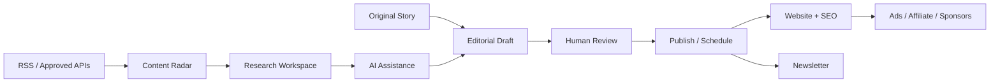
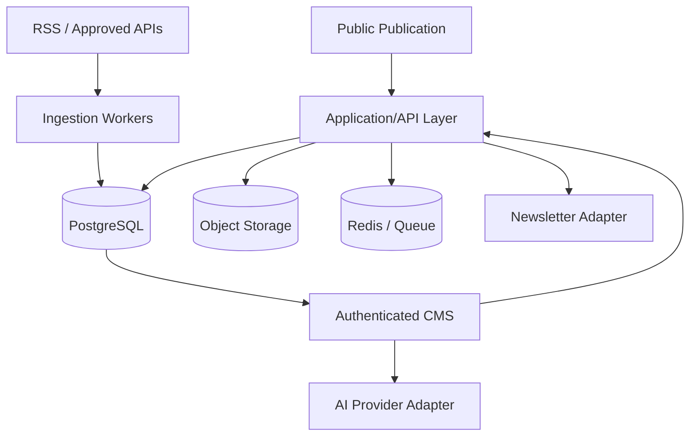

<div align="center">

# 📰 The Living Journal

### A human-led, AI-assisted technology publication

**Discover → Research → Edit → Publish → Distribute → Monetize**


A reusable Awwwards-inspired editorial frontend evolving into a production publishing platform for **AI, software, startups, products, careers, business and future technology**.

[Product Requirements](docs/PRD.md) · [Architecture](docs/ARCHITECTURE.md) · [Roadmap](docs/ROADMAP.md)

</div>

---

## ✨ Product idea

The Living Journal is not an automated news scraper. It combines original publishing with a future **Content Radar** for RSS/approved APIs and an **AI Editorial Copilot** for research and drafting.

> **APIs discover. AI assists. Humans decide. The Journal publishes.**



---

## 🚦 Current status

| Phase | Scope | Status |
|---|---|---|
| V2 | Reusable editorial frontend + GSAP visual system | ✅ Complete |
| V2.1 | UI recovery, responsive/internal-page polish | ✅ Complete |
| Phase 0 | Architecture decision + DB/infrastructure/CI | ⏭️ Next |
| Phase 1 | Authentication + RBAC | ⬜ Planned |
| Phase 2 | Production CMS + media | ⬜ Planned |
| Phase 3 | Content Radar + RSS/API ingestion | ⬜ Planned |
| Phase 4 | AI Editorial Copilot | ⬜ Planned |
| Phase 5 | SEO + sitemap + RSS/distribution | ⬜ Planned |
| Phase 6 | Audience + newsletter | ⬜ Planned |
| Phase 7 | Monetization | ⬜ Planned |
| Phase 8 | Analytics + hardening + launch | ⬜ Planned |

See [`docs/ROADMAP.md`](docs/ROADMAP.md) for phase exit criteria.

---

## 🎨 V2.1 UI recovery

The first GitHub push did not carry the complete visual styling from the working V2 source, which left the landing/internal routes visually incomplete and could produce a broken-looking page. V2.1 fixes that baseline before backend work begins.

### What was fixed

- ✅ Restored the layered editorial canvas instead of a flat/empty page.
- ✅ Rebuilt responsive header + working full-screen mobile navigation styling.
- ✅ Stabilized GSAP setup and removed the fragile full-page pinned rail behavior.
- ✅ Restored hero parallax, ticker motion, reveal motion and editorial media motion.
- ✅ Added complete styling for Stories, Category, Story Detail and Search.
- ✅ Added complete styling for Newsletter, About, Contact, Advertise, Legal and 404.
- ✅ Recovered detailed admin tables/forms/layout styling.
- ✅ Added small-screen layouts down to narrow mobile widths.
- ✅ Made demo `localStorage` access fail-safe so storage restrictions do not blank the app.
- ✅ Preserved `prefers-reduced-motion` behavior.

### Styling files

```text
src/styles/
├── tokens.css      # colors, typography, spacing tokens
├── global.css      # original structural/base rules
└── polish.css      # V2.1 recovery + detailed route/responsive styling
```

`polish.css` intentionally loads **after** the base styles. Once Phase 0 starts, we can consolidate these files carefully after visual regression checks instead of doing a risky rewrite now.

---

## 🧩 Current experience

The application currently includes:

- Layered editorial homepage with warm stone, sage and periwinkle surfaces.
- GSAP hero parallax, signal ticker, reveal choreography and editorial storytelling.
- Story archive and category filtering.
- Story detail reading progress and related stories.
- Search.
- Newsletter landing/signup demo.
- About, contact, advertising and legal pages.
- Responsive mobile menu.
- Local demo publisher/admin screens.
- Starter robots, sitemap and RSS assets.

> **V2 boundary:** publishing and subscribers still use browser `localStorage`. This is a frontend demo, not yet a secure multi-user CMS.

---

## 🗂️ Structure

```text
src/
├── app/
├── components/
│   └── global/
├── content/
├── context/
├── hooks/
├── screens/
│   ├── Home/
│   ├── Stories/
│   ├── StoryDetail/
│   ├── Category/
│   ├── Search/
│   ├── Newsletter/
│   ├── About/
│   ├── Contact/
│   ├── Advertise/
│   ├── Legal/
│   ├── NotFound/
│   └── Admin/
├── styles/
│   ├── tokens.css
│   ├── global.css
│   └── polish.css
├── types/
└── utils/

docs/
├── PRD.md
├── ARCHITECTURE.md
└── ROADMAP.md
```

Screen-specific components remain colocated with their screen. Shared site primitives stay under `components/global`.

---

## 🌐 Routes

### Public

| Route | Purpose |
|---|---|
| `/` | Editorial home |
| `/stories` | Story archive |
| `/stories/:slug` | Story detail |
| `/category/:slug` | Category archive |
| `/search` | Search |
| `/newsletter` | Newsletter |
| `/about` | About |
| `/contact` | Contact |
| `/advertise` | Sponsorship/advertising |
| `/legal/*` | Privacy, terms, affiliate disclosure |

### Publisher demo

| Route | Purpose |
|---|---|
| `/admin` | Dashboard |
| `/admin/posts` | Manage stories |
| `/admin/posts/new` | New story |
| `/admin/posts/:id/edit` | Edit story |
| `/admin/audience` | Demo subscribers |
| `/admin/settings` | Settings/demo reset |

These admin routes are not authenticated until Phase 1.

---

## 🛠️ Run locally

Requirements: **Node.js 20+** and npm.

```bash
git pull origin main
npm install
npm run dev
```

Production check:

```bash
npm run typecheck
npm run build
npm run preview
```

If you cloned before the V2.1 recovery, make sure you `git pull origin main` and restart Vite so the new `polish.css` import is loaded.

---

## 🧱 Target production architecture



Phase 0 will formally decide between the recommended **Next.js production migration** and a separated **Vite + NestJS** architecture. See [`docs/ARCHITECTURE.md`](docs/ARCHITECTURE.md).

---

## 🤖 Contributor / AI-agent guide

Before substantial work, read:

1. [`docs/PRD.md`](docs/PRD.md) — what we are building.
2. [`docs/ARCHITECTURE.md`](docs/ARCHITECTURE.md) — system boundaries and workflows.
3. [`docs/ROADMAP.md`](docs/ROADMAP.md) — what phase is allowed next.

### Rules

- ✅ Work phase-by-phase.
- ✅ Preserve the reusable screen/component architecture.
- ✅ Preserve the warm editorial visual identity unless a deliberate redesign is approved.
- ✅ External stories enter Content Radar; never auto-publish them.
- ✅ AI output remains editable and human-approved.
- ✅ Add loading, empty, error, mobile and reduced-motion states.
- ✅ Keep secrets and authorization server-side when backend work begins.
- ❌ Never commit `.env`, API keys or secrets.
- ❌ Do not mark a phase done because only its UI exists.

### 📚 Documentation is part of every feature

| Change | Update |
|---|---|
| Setup, env var, route, visible workflow | `README.md` |
| Product scope / behavior | `docs/PRD.md` |
| Architecture / provider / data flow / security | `docs/ARCHITECTURE.md` |
| Phase progress | `docs/ROADMAP.md` + README status |

The root README should stay visual and easy to scan. Deep engineering details belong under `docs/`.

---

<div align="center">

### The Living Journal

**Minimal, not empty. Editorial, not generic. Automated where useful, human where it matters.**

`V2.1 UI Recovery → Production Foundation → CMS → Radar → AI → Distribution → Revenue`

</div>
