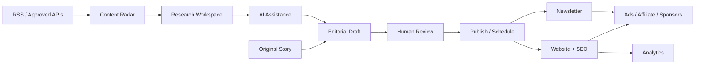
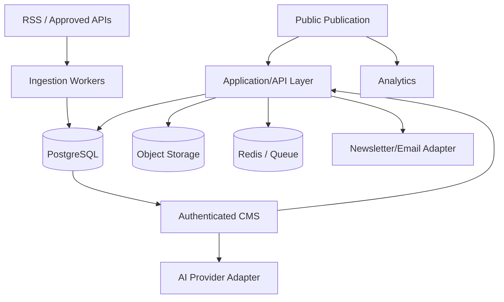

<div align="center">

# 📰 The Living Journal

### A human-led, AI-assisted technology publication

**Discover → Research → Edit → Publish → Distribute → Monetize**


A reusable Awwwards-inspired editorial frontend evolving into a production publishing platform for **AI, software, startups, products, careers, business and future technology**.

[Product Requirements](docs/PRD.md) · [Architecture](docs/ARCHITECTURE.md) · [Roadmap](docs/ROADMAP.md)

</div>

---

## ✨ What we're building

The Living Journal is not intended to become an automated news scraper. The product combines original publishing with a **Content Radar** that discovers useful stories from RSS/approved APIs and an **AI Editorial Copilot** that helps editors research and draft.

> **APIs discover. AI assists. Humans decide. The Journal publishes.**

The long-term business combines quality editorial content, SEO, newsletters, affiliate content, sponsorships and eventually advertising/digital products.

---

## 🧭 Core workflow



**Important:** external source items are editorial leads. They are never silently copied or auto-published, and AI never receives direct production-publish authority.

---

## 🚦 Project status

| Phase | Scope | Status |
|---|---|---|
| V2 | Reusable editorial frontend + GSAP visual system | ✅ Complete |
| Phase 0 | Architecture decision + DB/infrastructure/CI foundation | ⏭️ Next |
| Phase 1 | Authentication + RBAC | ⬜ Planned |
| Phase 2 | Production CMS + media + persistent content | ⬜ Planned |
| Phase 3 | Content Radar + RSS/API ingestion | ⬜ Planned |
| Phase 4 | AI Editorial Copilot | ⬜ Planned |
| Phase 5 | Dynamic SEO + sitemap + RSS/distribution | ⬜ Planned |
| Phase 6 | Audience + production newsletter | ⬜ Planned |
| Phase 7 | Monetization | ⬜ Planned |
| Phase 8 | Analytics + hardening + launch | ⬜ Planned |

See [`docs/ROADMAP.md`](docs/ROADMAP.md) for deliverables and exit criteria.

---

## 🎨 V2 experience

The current application provides:

- 🏠 Layered editorial homepage with warm stone, sage and periwinkle surfaces.
- 🎞️ GSAP hero parallax, scroll-linked storytelling, signal ticker and pinned editorial rail.
- 🗞️ Story archive, category pages, search and story details.
- ✍️ Reusable local demo post editor with drafts/publishing.
- 📬 Newsletter signup demo and audience screen.
- 📱 Responsive behavior and reduced-motion support.
- 🧩 Screen-local components plus reusable global components.
- 🔎 Starter robots, sitemap and RSS assets.

### ⚠️ Current V2 boundary

V2 uses browser `localStorage` for demo publishing/subscribers. It is **not yet a multi-user production CMS**. Authentication, durable content, media, source ingestion, AI, newsletter delivery and monetization are intentionally part of the phased V3 roadmap.

---

## 🗂️ Current project structure

```text
src/
├── app/
│   └── App.tsx
├── components/
│   └── global/                 # shared public UI
├── content/
│   ├── categories.ts
│   └── seedPosts.ts
├── context/
│   └── ContentContext.tsx      # V2 local demo persistence
├── hooks/
├── screens/
│   ├── Home/
│   │   ├── HomeScreen.tsx
│   │   └── components/
│   │       ├── Hero.tsx
│   │       ├── SignalTicker.tsx
│   │       ├── LeadStory.tsx
│   │       ├── LatestStories.tsx
│   │       ├── BriefingGrid.tsx
│   │       ├── EditorialRail.tsx
│   │       ├── Trending.tsx
│   │       └── NewsletterBand.tsx
│   ├── Stories/
│   ├── StoryDetail/
│   ├── Category/
│   ├── Search/
│   ├── Newsletter/
│   ├── About/
│   ├── Contact/
│   ├── Advertise/
│   ├── Legal/
│   ├── NotFound/
│   └── Admin/
├── styles/
│   ├── tokens.css
│   └── global.css
├── types/
└── utils/

docs/
├── PRD.md
├── ARCHITECTURE.md
└── ROADMAP.md
```

Screen-specific components stay with their screen; components shared across multiple product areas belong in the global/shared layer.

---

## 🌐 Routes today

### Public

| Route | Purpose |
|---|---|
| `/` | Editorial home |
| `/stories` | Story archive |
| `/stories/:slug` | Story detail |
| `/category/:slug` | Category archive |
| `/search` | Search |
| `/newsletter` | Newsletter landing |
| `/about` | Publication story |
| `/contact` | Contact |
| `/advertise` | Sponsorship/advertising |
| `/legal/*` | Privacy, terms and affiliate disclosure |

### Publisher demo

| Route | Purpose |
|---|---|
| `/admin` | Overview |
| `/admin/posts` | Manage stories |
| `/admin/posts/new` | Create story |
| `/admin/posts/:id/edit` | Edit story |
| `/admin/audience` | Demo subscribers |
| `/admin/settings` | Publication/demo settings |

These admin routes are UI/demo routes until Phase 1 introduces real authentication and authorization.

---

## ✍️ V2 editor syntax

The lightweight editor supports reusable blocks:

```text
Normal paragraph

## Heading

> Pull quote

 "Optional caption"
```

Phase 2 will replace/upgrade this with a production structured editor while preserving a clean article data model.

---

## 🧱 Target production architecture



The preferred direction is to evaluate a **Next.js production migration** so public stories have strong server-rendered SEO while preserving the V2 React components/design system. A Vite + NestJS service architecture remains an alternative; Phase 0 must record the final decision before implementation expands.

Deep technical details: [`docs/ARCHITECTURE.md`](docs/ARCHITECTURE.md).

---

## 💰 Revenue model

The product is designed to support several channels instead of depending on one:

| Channel | Intended use |
|---|---|
| 📢 Display advertising | Activated only when content/traffic justify it |
| 🔗 Affiliate content | Useful tool/product comparisons with disclosure |
| 🤝 Sponsorships | Sponsored stories, placements and campaigns |
| 📬 Newsletter sponsorship | Monetize a direct subscriber audience |
| 📦 Digital products | Later: guides, templates, developer resources |

Monetization must never overwhelm editorial quality. Sponsored and affiliate relationships must be clearly disclosed.

---

## 🛠️ Local development

### Requirements

- Node.js 20+ recommended
- npm

### Start

```bash
npm install
npm run dev
```

### Production build

```bash
npm run build
npm run preview
```

> The V2 source was created before the production backend phase. Phase 0 will add formal environment validation, database setup and CI instructions here once those choices are implemented.

---

## 🤖 Contributor & AI-agent guide

Before making a substantial change, read:

1. [`docs/PRD.md`](docs/PRD.md) — **what** the product must do.
2. [`docs/ARCHITECTURE.md`](docs/ARCHITECTURE.md) — **how** production responsibilities are separated.
3. [`docs/ROADMAP.md`](docs/ROADMAP.md) — **what phase is allowed next**.

### Development rules

- ✅ Work phase-by-phase; do not implement future phases accidentally.
- ✅ Preserve the V2 visual identity and reusable component architecture.
- ✅ Keep server authorization and publishing rules out of client-only logic.
- ✅ External stories enter Content Radar; they do not auto-publish.
- ✅ AI output remains editable and human-approved.
- ✅ Add loading, empty, error and reduced-motion states.
- ✅ Validate inputs and keep secrets server-side.
- ❌ Do not commit `.env`, API keys or provider secrets.
- ❌ Do not introduce a provider response shape directly throughout UI/domain models.
- ❌ Do not mark a phase complete only because its UI exists.

### 📚 Documentation is part of the feature

**Every contributor and coding agent must update docs in the same change when behavior changes.**

| Change | Documentation to update |
|---|---|
| Setup command / env var / route / workflow | `README.md` |
| Product scope or user behavior | `docs/PRD.md` |
| Architecture, provider, data flow or security decision | `docs/ARCHITECTURE.md` |
| Phase progress/completion | `docs/ROADMAP.md` + README status table |

The root README should remain **visual, friendly and quick to navigate**. Put detailed engineering discussion in `docs/` instead of turning the README into a wall of text.

---

## ✅ Definition of done

A feature/phase is done only when its behavior works end-to-end, relevant security is enforced, important edge states are handled, verification passes, no secrets are committed, and documentation reflects reality.

For complete phase exit criteria see [`docs/ROADMAP.md`](docs/ROADMAP.md).

---

<div align="center">

### The Living Journal

**Minimal, not empty. Editorial, not generic. Automated where useful, human where it matters.**

`V2 → Production Foundation → CMS → Radar → AI → Distribution → Revenue`

</div>
