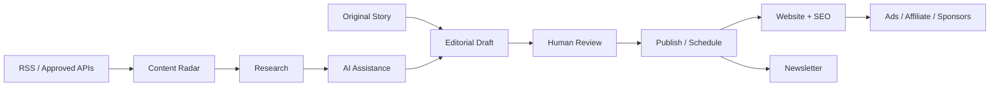
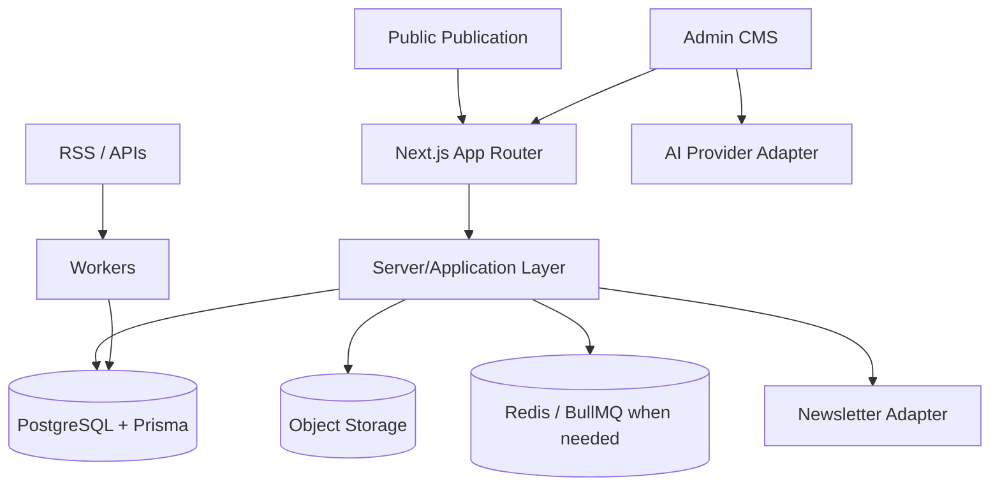

<div align="center">

# 📰 The Living Journal

### A human-led, AI-assisted technology publication

**Discover → Research → Edit → Publish → Distribute → Monetize**


A premium editorial frontend evolving into a production platform for **AI, software, startups, products, careers, business and future technology**.

[PRD](docs/PRD.md) · [Architecture](docs/ARCHITECTURE.md) · [Roadmap](docs/ROADMAP.md) · [ADR-001](docs/adr/ADR-001-nextjs-production-architecture.md) · [Phase 0 Plan](docs/PHASE-0-MIGRATION-PLAN.md)

</div>

---

## ✨ Product principle

The Living Journal is not an automated news scraper.

> **APIs discover. AI assists. Humans decide. The Journal publishes.**



---

## 🚦 Current status

| Milestone | Status |
|---|---|
| V2.1 editorial UI baseline | ✅ Stable |
| Phase 0A — freeze V2.1 | ✅ Complete |
| Phase 0B — Next.js App Router migration | ✅ Implemented |
| Phase 0C — GSAP + SSR/client verification | 🟡 Current gate |
| Phase 0D — PostgreSQL + Prisma | ⬜ Next |
| Phase 0E — Redis/queue boundary | ⬜ Planned |
| Phase 0F — CI + reproducible setup | ⬜ Planned |
| Phase 0G — full visual QA | ⬜ Planned |
| Phase 1 — Auth/RBAC | ⬜ Planned |
| Phase 2 — Production CMS | ⬜ Planned |
| Phase 3 — Content Radar | ⬜ Planned |
| Phase 4 — AI Editorial Copilot | ⬜ Planned |
| Phase 5–8 — SEO, audience, revenue, launch | ⬜ Planned |

The detailed gates live in [`docs/PHASE-0-MIGRATION-PLAN.md`](docs/PHASE-0-MIGRATION-PLAN.md).

---

## 🚀 Phase 0B — Next.js migration

The repository now uses **Next.js App Router as the active runtime**. This was deliberately a framework/runtime migration rather than a visual redesign.

### What changed

- ✅ Vite runtime replaced by Next.js App Router.
- ✅ React Router removed from the active app.
- ✅ Existing `screens/`, reusable components and V2.1 styles retained.
- ✅ Public and admin routes mapped into `src/app`.
- ✅ `next/link` and `next/navigation` used for navigation/params.
- ✅ Root metadata foundation added.
- ✅ Initial story metadata added from seed content.
- ✅ `/api/health` added.
- ✅ Browser-dependent modules given explicit client boundaries.
- ✅ `localStorage` demo state made hydration-safe.
- ✅ Stabilized V2.1 GSAP behavior retained.
- ✅ Obsolete Vite entry/config files removed.

### What did **not** change yet

- Admin routes are still demo-only and unauthenticated.
- Content/subscribers still use local demo state.
- PostgreSQL/Prisma are not connected yet.
- Content Radar, AI, newsletter delivery and monetization remain later phases.

---

## 🎨 V2.1 visual baseline

Phase 0 must preserve the accepted UI:

- layered editorial homepage;
- GSAP hero parallax, ticker and reveal choreography;
- Stories, Category, Story Detail and Search;
- Newsletter, About, Contact, Advertise, Legal and 404;
- Admin dashboard/posts/editor/audience/settings demo;
- responsive/mobile layouts;
- reduced-motion behavior.

Styles remain intentionally layered:

```text
src/styles/
├── tokens.css      # design tokens
├── global.css      # structural/base styling
└── polish.css      # detailed V2.1 route/responsive treatment
```

Do not consolidate or redesign these during infrastructure work without visual regression checks.

---

## 🗂️ Active structure

```text
src/
├── app/
│   ├── layout.tsx
│   ├── not-found.tsx
│   ├── (public)/
│   │   ├── page.tsx
│   │   ├── stories/
│   │   ├── category/
│   │   ├── search/
│   │   ├── newsletter/
│   │   ├── about/
│   │   ├── contact/
│   │   ├── advertise/
│   │   └── legal/
│   ├── admin/
│   └── api/health/route.ts
├── components/
├── content/
├── context/            # temporary demo persistence
├── hooks/
├── screens/            # retained V2.1 screen architecture
├── styles/
├── types/
└── utils/

docs/
├── adr/
├── PRD.md
├── ARCHITECTURE.md
├── ROADMAP.md
└── PHASE-0-MIGRATION-PLAN.md
```

---

## 🌐 Routes

### Public

| Route | Purpose |
|---|---|
| `/` | Editorial home |
| `/stories` | Story archive |
| `/stories/[slug]` | Story detail |
| `/category/[slug]` | Category archive |
| `/search` | Search |
| `/newsletter` | Newsletter |
| `/about` | About |
| `/contact` | Contact |
| `/advertise` | Sponsorship/advertising |
| `/legal/[page]` | Privacy, terms, affiliate disclosure |

### Publisher demo

| Route | Purpose |
|---|---|
| `/admin` | Dashboard |
| `/admin/posts` | Manage stories |
| `/admin/posts/new` | New story |
| `/admin/posts/[id]/edit` | Edit story |
| `/admin/audience` | Demo subscribers |
| `/admin/settings` | Settings/demo reset |

### Runtime health

```text
GET /api/health
```

Expected shape:

```json
{
  "status": "ok",
  "service": "living-journal",
  "runtime": "nextjs"
}
```

---

## 🛠️ Run locally

Requirements: **Node.js 20+** and npm.

```bash
git pull origin main
npm install
```

Create local environment config:

```bash
cp .env.example .env.local
```

On Windows PowerShell you can use:

```powershell
Copy-Item .env.example .env.local
```

Start development:

```bash
npm run dev
```

Then open:

```text
http://localhost:3000
http://localhost:3000/api/health
```

### Verification gate

Before Phase 0D begins, run:

```bash
npm run typecheck
npm run build
npm run start
```

Then manually check Home, Stories, Story Detail, Search, About and Admin while watching the browser console for hydration/runtime errors.

> The migration was structurally implemented and pushed, but the assistant execution environment cannot download npm packages, so a full `next build` could not be run there. Local verification is therefore an explicit Phase 0C gate rather than being falsely reported as passed.

---

## 🧱 Accepted production architecture



ADR: [`docs/adr/ADR-001-nextjs-production-architecture.md`](docs/adr/ADR-001-nextjs-production-architecture.md)

---

## 💰 Planned business model

- 📢 restrained display advertising;
- 🔗 useful affiliate content with disclosure;
- 🤝 sponsorships;
- 📬 newsletter sponsorship;
- 📦 later digital products.

Monetization is intentionally not implemented before the content/audience foundation.

---

## 🤖 Contributor / AI-agent rules

Read before substantial work:

1. [`docs/PRD.md`](docs/PRD.md)
2. [`docs/adr/ADR-001-nextjs-production-architecture.md`](docs/adr/ADR-001-nextjs-production-architecture.md)
3. [`docs/ARCHITECTURE.md`](docs/ARCHITECTURE.md)
4. [`docs/PHASE-0-MIGRATION-PLAN.md`](docs/PHASE-0-MIGRATION-PLAN.md)
5. [`docs/ROADMAP.md`](docs/ROADMAP.md)

### Non-negotiables

- ✅ Work phase-by-phase.
- ✅ Preserve V2.1 visual behavior during Phase 0.
- ✅ Reuse existing React screens/components when practical.
- ✅ Keep GSAP/browser APIs behind client boundaries.
- ✅ Keep secrets/database/provider code server-side.
- ✅ External stories eventually enter Radar; never auto-publish them.
- ✅ AI output remains editable and human-approved.
- ❌ Never commit `.env` secrets.
- ❌ Do not silently implement Phase 1+ while Phase 0 is incomplete.
- ❌ Do not call something complete without its verification gate.

### 📚 Documentation is part of the feature

| Change | Update |
|---|---|
| Setup/env/route/visible workflow | `README.md` |
| Product scope | `docs/PRD.md` |
| Architecture/data/security | `docs/ARCHITECTURE.md` + ADR if needed |
| Phase 0 execution | `docs/PHASE-0-MIGRATION-PLAN.md` |
| Phase progress | `docs/ROADMAP.md` + README |

---

<div align="center">

### The Living Journal

**Minimal, not empty. Editorial, not generic. Automated where useful, human where it matters.**

`V2.1 Stable → Next.js ✅ → Runtime Verification 🟡 → PostgreSQL/Prisma → Auth → CMS → Radar → AI → Revenue`

</div>
