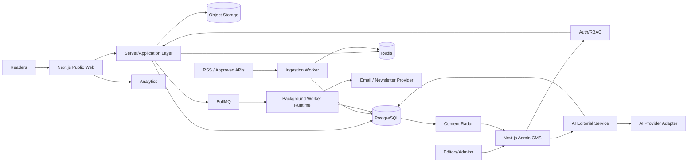
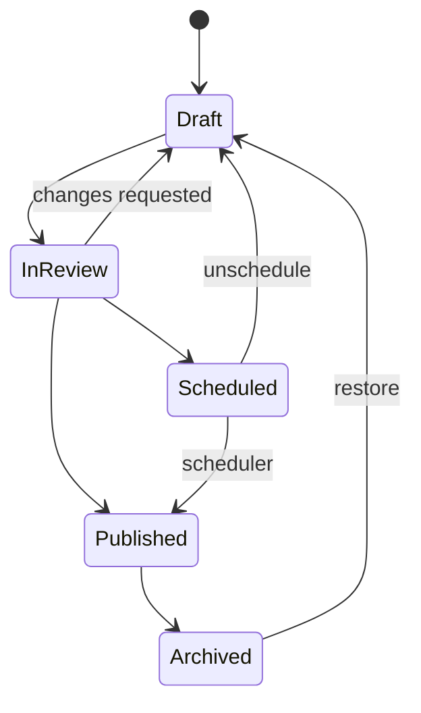
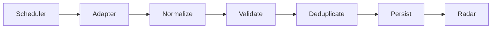
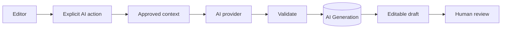
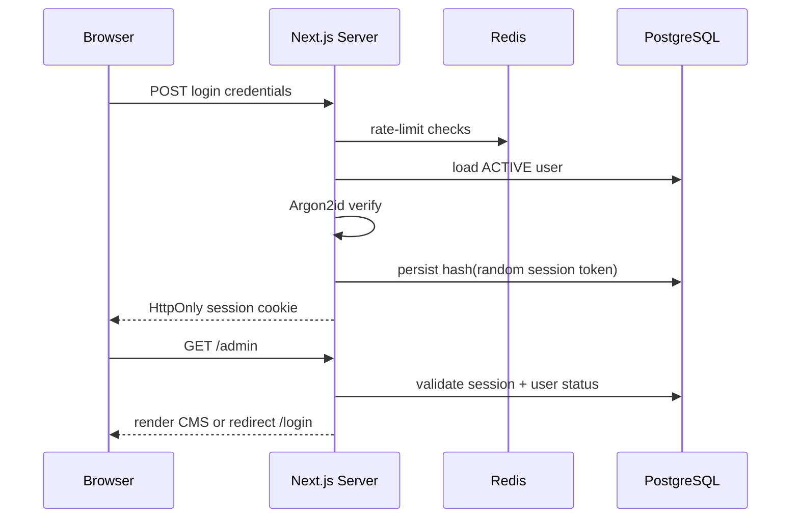

# 🏗️ The Living Journal — Architecture

> **Accepted application direction:** Next.js App Router + TypeScript + PostgreSQL/Prisma, with Redis/BullMQ for durable background workflows. Authentication follows [`ADR-002`](adr/ADR-002-authentication-session-rbac.md).

The accepted V2.1 visual system remains the UI reference while production capabilities are added behind it.

## 1. Current implementation checkpoint

### Phase 0 ✅ complete

Implemented and locally verified:

- Next.js App Router public/admin route tree;
- React 19 + TypeScript;
- GSAP/ScrollTrigger client boundaries with cleanup/reduced-motion support;
- PostgreSQL 16 + Prisma 7.10 runtime/migrations/seed;
- Redis 7 + BullMQ producer boundary;
- server environment validation;
- runtime, PostgreSQL and Redis health endpoints;
- deterministic `npm ci` + `npm run verify` developer gate;
- final V2.1 visual/manual regression QA.

### Phase 1 🟡 current

Designed, not yet implemented:

- Prisma `User` / `Session` auth persistence;
- Argon2id password hashing;
- opaque DB-backed sessions;
- `/login` and logout;
- protected `/admin/**` server boundary;
- ADMIN/EDITOR RBAC/capabilities;
- Redis login throttling;
- same-origin mutation protection;
- first-admin bootstrap;
- auth audit/security tests.

Detailed plan: [`PHASE-1-AUTH-PLAN.md`](PHASE-1-AUTH-PLAN.md).

## 2. Architecture principles

- Human-controlled editorial publishing.
- Clear separation between public reading, CMS, ingestion, AI and monetization.
- Server/application layer owns authentication, authorization, publishing transitions and durable data.
- Background work requiring reliability is durable/retryable.
- External providers live behind adapters.
- Public pages prioritize SEO, accessibility and performance.
- Documentation changes ship with workflow/architecture changes.
- One Next.js application boundary does **not** mean client/server concerns may be mixed.
- UI hiding is never authorization.

## 3. Target system



## 4. Accepted stack

### Application runtime
- Next.js App Router
- React 19
- TypeScript
- existing `tokens.css` + `global.css` + `polish.css`
- GSAP + ScrollTrigger for client-only storytelling motion

### Data foundation
- PostgreSQL 16 — canonical durable datastore
- Prisma 7.10 — schema/migrations/typed DB access

### Durable workflow foundation
- Redis 7 — rate limits/cache/job infrastructure
- BullMQ — durable ingestion, scheduled publishing, newsletter and AI background jobs when owning phases implement workers

### Authentication foundation
- first-party email/password for internal CMS users
- Argon2id password hashing
- opaque random session cookie
- SHA-256 session-token hash stored in PostgreSQL
- server-side ADMIN/EDITOR capability checks
- Redis-backed login throttling

### Provider boundaries
- S3-compatible storage / Cloudinary adapter for media
- email/newsletter provider behind an adapter
- AI provider behind a server-only adapter with usage logging
- analytics behind a thin event interface
- RSS/API adapters normalize external data into internal models

### Why no NestJS service initially
A separate NestJS API would add deployment, CORS, session/auth and DTO duplication while the publication needs a server-rendered web runtime. If future scale/team ownership requires services, that requires a new ADR.

## 5. Active repository shape

```text
/
├── docs/
│   ├── adr/
│   │   ├── ADR-001-nextjs-production-architecture.md
│   │   └── ADR-002-authentication-session-rbac.md
│   ├── PRD.md
│   ├── ARCHITECTURE.md
│   ├── ROADMAP.md
│   ├── PHASE-0-MIGRATION-PLAN.md
│   ├── PHASE-0G-QA.md
│   └── PHASE-1-AUTH-PLAN.md
├── prisma/
│   ├── schema.prisma
│   ├── seed.ts
│   └── migrations/
├── public/
├── src/
│   ├── app/
│   │   ├── (public)/
│   │   ├── admin/
│   │   ├── api/health/
│   │   ├── layout.tsx
│   │   └── not-found.tsx
│   ├── server/
│   │   ├── db/
│   │   ├── redis/
│   │   └── jobs/
│   ├── components/
│   ├── screens/
│   ├── content/
│   ├── context/          # temporary local demo content state until Phase 2
│   ├── hooks/
│   ├── styles/
│   ├── types/
│   └── utils/
├── compose.yaml
├── next.config.ts
├── tsconfig.json
├── .env.example
└── README.md
```

Phase 1 may add `src/server/auth/` and auth route/UI modules without reorganizing unrelated working UI.

## 6. Server/client boundary

Prefer server-rendered routes/components for canonical public data and authentication decisions. Use client components only for behavior that genuinely needs the browser.

Browser-only examples:

- GSAP/ScrollTrigger;
- mobile-menu state;
- temporary interactive archive/search filtering;
- temporary V2.1 localStorage demo flows;
- form interaction/admin demo state.

Server-only examples:

- Prisma/database access;
- Redis access;
- password hashing;
- session token creation/lookup/revocation;
- authorization guards;
- provider credentials;
- publishing state transitions.

Rules:

- browser storage loads only after mount where still temporarily used;
- `window`, `document`, `localStorage`, `matchMedia` and GSAP may not execute in server-evaluated code;
- secrets/auth internals may not enter client bundles;
- client role checks may improve UX but cannot grant access.

## 7. Routing & metadata

Current route foundation:

```text
/
/stories
/stories/[slug]
/category/[slug]
/search
/newsletter
/about
/contact
/advertise
/legal/[page]
/admin
/admin/posts
/admin/posts/new
/admin/posts/[id]/edit
/admin/audience
/admin/settings
/api/health
/api/health/database
/api/health/redis
```

Phase 1 adds a public `/login` route and server auth endpoints/actions as needed.

Root metadata is provided through `src/app/layout.tsx`. Story routes currently generate seed-backed metadata as a migration scaffold. Production canonical SEO sourced from the database remains Phase 5.

## 8. Publishing architecture



Server-side application services will own transitions. The CMS requests transitions; it does not authorize itself.

## 9. Content Radar boundary

Every external provider must normalize into an internal source contract rather than leaking provider response shapes through the product.

```ts
interface NormalizedSourceItem {
  externalId?: string
  sourceId: string
  canonicalUrl: string
  title: string
  summary?: string
  author?: string
  publishedAt?: Date
  discoveredAt: Date
  imageUrl?: string
  categories?: string[]
  rawFingerprint: string
}
```



A source item is a research lead, never public content by itself.

## 10. AI boundary



AI remains server-mediated and cannot directly publish.

## 11. Authentication & authorization — Phase 1

Architecture source of truth: [`ADR-002`](adr/ADR-002-authentication-session-rbac.md) and [`PHASE-1-AUTH-PLAN.md`](PHASE-1-AUTH-PLAN.md).

### Roles

| Capability | ADMIN | EDITOR |
|---|---:|---:|
| Enter/read CMS | ✅ | ✅ |
| Create/edit drafts | ✅ | ✅ |
| Review/publish | ✅ | ✅ |
| Audience read | ✅ | ✅ initially |
| Manage sources | ✅ | future decision |
| Manage publication settings | ✅ | ❌ |
| Manage monetization | ✅ | ❌ |
| Manage users/roles | ✅ | ❌ |

### Session boundary



Session tokens are random opaque values; raw tokens are never persisted in PostgreSQL.

### Authorization rules

- `/admin/**` requires a valid authenticated session at the server layout boundary;
- server mutations additionally require appropriate capabilities;
- `/admin/settings` is ADMIN-only in Phase 1;
- disabled/expired/revoked sessions fail closed;
- return paths are validated local paths only;
- state-changing cookie-authenticated requests validate same-origin intent;
- login throttling is Redis-backed.

## 12. Data boundaries

- **User** — internal authenticated CMS identity
- **Session** — revocable opaque login session
- **AuditLog** — security/editorial event trail as owning phases implement events
- **Post** — first-party publication content
- **SourceItem** — third-party discovery/research metadata
- **PostSource** — attribution relationship
- **AiGeneration** — assistance/usage record
- **PostRevision** — editorial history
- **Subscriber** — protected audience data
- monetization records separated from article content where practical

## 13. Media

Production media will use authorized persistent object storage, recording MIME type, dimensions, alt text, attribution and storage key. Browser object URLs are not durable publication assets.

## 14. SEO

Next.js is the rendering foundation for canonical metadata, article structured data, sitemaps, RSS and redirects. Phase 5 connects those outputs to canonical database content and search-distribution policy.

## 15. Jobs & reliability

Durable jobs are required for source ingestion, scheduled publishing, newsletter sends and other retry-sensitive work. Important jobs need stable IDs/idempotency, attempts/failure records and worker-capable runtime placement.

## 16. Security baseline

- secrets only in environment/secret manager;
- server-side input validation;
- Argon2id password hashing;
- opaque HttpOnly sessions with database revocation;
- CSRF/same-origin protection for cookie-authenticated mutations;
- Redis rate limiting for auth and later sensitive/expensive endpoints;
- sanitized rich content;
- upload validation;
- least-privilege credentials;
- audit important admin/security actions;
- never commit real `.env` secrets;
- never log passwords, raw cookies or raw session tokens.

## 17. Observability

Eventually capture application errors, auth/security events, ingestion/job failures, publishing failures, email failures, AI usage/failures and public performance metrics without leaking secrets or unnecessary PII.

## 18. Current source of truth

Phase 0 records remain in [`PHASE-0-MIGRATION-PLAN.md`](PHASE-0-MIGRATION-PLAN.md) and [`PHASE-0G-QA.md`](PHASE-0G-QA.md).

Current implementation gate: [`PHASE-1-AUTH-PLAN.md`](PHASE-1-AUTH-PLAN.md).

## 19. Documentation rule

Update documentation in the same change when setup, routes, workflows, architecture, security boundaries, environment variables or phase status change. This applies equally to human contributors and AI coding agents.
