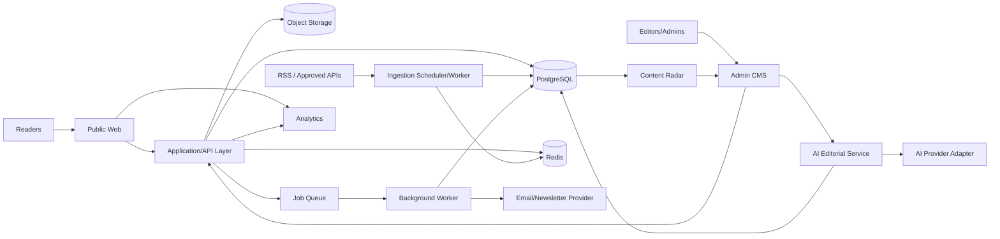
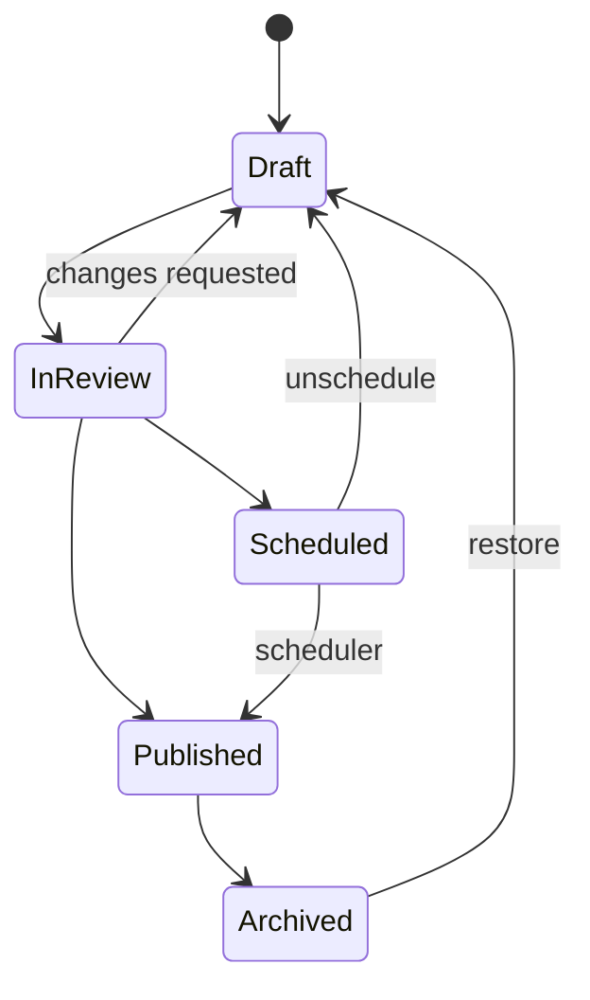
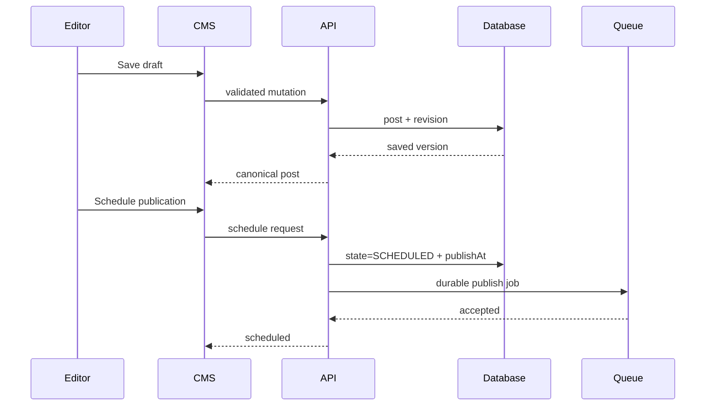
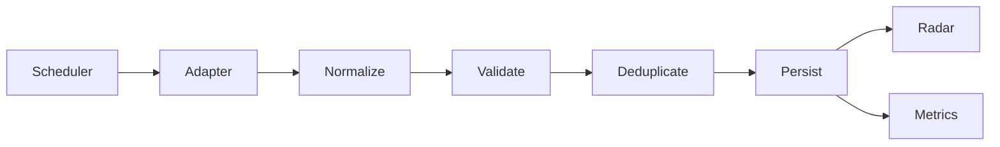
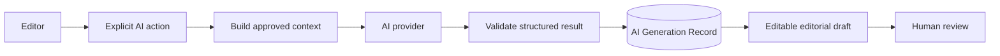

# 🏗️ The Living Journal — Architecture

> This document describes the **target production architecture**. V2 is currently a React/Vite frontend with local demo persistence; V3 incrementally replaces those adapters without discarding the visual system.

## 1. Architecture principles

- Human-controlled editorial publishing.
- Clear separation between public reading, editorial CMS, ingestion, AI and monetization.
- Backend owns authorization, publishing transitions and durable data.
- Background work is durable/retryable.
- External providers sit behind adapters so they can be changed.
- Public pages prioritize SEO, accessibility and performance.
- Documentation changes ship with architecture/workflow changes.

## 2. Target system



## 3. Recommended production stack

### Web
- TypeScript
- React
- **Recommended migration target: Next.js App Router** for production public rendering/metadata while preserving reusable React components and design tokens.
- Tailwind or the existing CSS/token system; do not rewrite visual styling solely for framework migration.
- GSAP + ScrollTrigger for intentional storytelling motion.

### Backend/data
Two acceptable paths exist, but choose one before implementation:

**Preferred integrated path:** Next.js server layer + PostgreSQL + Prisma + Redis/BullMQ.

**Alternative service path:** existing Vite frontend + NestJS API + PostgreSQL/Prisma + Redis/BullMQ. If this path is selected, public SEO must have a deliberate SSR/pre-render strategy.

The implementation phase must record the final ADR before large-scale migration.

### Infrastructure/providers
- PostgreSQL for durable relational data.
- Redis for queue/cache/rate-limit use cases.
- BullMQ or equivalent durable jobs for ingestion, scheduled publish and campaign work.
- S3-compatible object storage / Cloudinary for media.
- Resend or a dedicated newsletter provider behind an email adapter.
- Analytics provider behind a thin event interface.
- AI provider behind a server-side adapter with usage logging.

## 4. Repository direction

Current V2 remains organized around reusable screens and components. V3 should evolve toward:

```text
/
├── docs/
│   ├── PRD.md
│   ├── ARCHITECTURE.md
│   └── ROADMAP.md
├── public/
├── src/
│   ├── app/
│   ├── components/
│   │   └── global/
│   ├── screens/
│   ├── features/             # V3 domain-oriented UI/modules
│   │   ├── auth/
│   │   ├── publishing/
│   │   ├── radar/
│   │   ├── media/
│   │   ├── newsletter/
│   │   └── monetization/
│   ├── server/               # if integrated Next.js path is selected
│   │   ├── auth/
│   │   ├── db/
│   │   ├── services/
│   │   ├── jobs/
│   │   └── adapters/
│   ├── styles/
│   └── types/
└── README.md
```

Do not move files simply to match this tree. Introduce folders when a real V3 feature needs them.

## 5. Publishing architecture

### State machine



Server-side service methods own transitions. The UI requests transitions; it does not decide authorization.

### Story write path



## 6. Content Radar architecture

### Source adapters
Every external source should normalize to a common `SourceItem` contract:

```ts
interface NormalizedSourceItem {
  externalId?: string
  sourceId: string
  canonicalUrl: string
  title: string
  summary?: string
  author?: string
  publishedAt?: Date
  discoveredAt: Date
  imageUrl?: string
  categories?: string[]
  rawFingerprint: string
}
```

Do not make the public article model depend directly on a provider's response shape.

### Ingestion flow



Deduplication should use canonical URL/provider IDs plus a normalized title/content fingerprint strategy. Failed source runs record error metadata and retry according to policy.

## 7. AI architecture

AI is a service used by the CMS, not an autonomous publisher.



Store provider/model, action type, timestamps, token/cost information when available and linkage to the relevant post/source item. Never expose provider keys client-side.

## 8. Authentication & authorization

Initial roles:

| Capability | ADMIN | EDITOR |
|---|---:|---:|
| Read CMS | ✅ | ✅ |
| Create/edit drafts | ✅ | ✅ |
| Review/publish | ✅ | ✅ |
| Manage sources | ✅ | Optional |
| Manage monetization | ✅ | ❌ |
| Manage users/settings | ✅ | ❌ |

Authorization is checked on the server for every protected mutation. Hiding a button is not authorization.

## 9. Data boundaries

- **Post** is first-party publication content.
- **SourceItem** is third-party discovery/research metadata.
- **PostSource** records attribution/research relationships.
- **AiGeneration** records assistance, not canonical article content.
- **PostRevision** preserves editorial history.
- **Subscriber** contains audience data and must never be included in public static payloads.
- Monetization records remain separate from article body blocks where possible.

## 10. Media

Production uploads use signed/server-authorized upload flows and persistent storage. Store metadata such as dimensions, MIME type, alt text, attribution and storage key. Do not persist temporary local/browser object URLs as article assets.

## 11. SEO rendering

Production story pages need crawlable HTML and dynamic metadata. This is the strongest reason to prefer a Next.js migration for the public application.

Per published story:
- canonical URL
- title/meta description
- Open Graph/Twitter metadata
- Article structured data
- breadcrumbs where appropriate
- indexability controls

Site-level:
- dynamic sitemap
- RSS
- robots rules
- redirects for changed slugs

## 12. Jobs & reliability

Use durable jobs for:
- source ingestion
- scheduled publishing
- newsletter sends
- expensive asynchronous AI tasks if required
- analytics/provider synchronization

Jobs need stable IDs/idempotency where duplicate execution could cause duplicate publishes or sends. Record attempts/failures and provide admin visibility for operationally important jobs.

## 13. Security baseline

- Secrets only in environment/secret manager.
- Server-side schema validation.
- Secure session cookies if cookie sessions are selected.
- CSRF protection where applicable.
- Rate limiting for auth/forms/AI.
- Sanitized rich text.
- Strict upload type/size validation.
- Least-privilege provider credentials.
- Audit important admin actions.
- Do not commit `.env` files.

## 14. Observability

At minimum capture:
- application errors
- ingestion success/failure/duration
- queue failures
- publish failures
- email campaign failures
- AI provider failures/usage
- web vitals/public performance

## 15. Documentation rule

Every material change must update documentation in the same branch/commit when applicable:

- New/changed user workflow → `README.md` workflow summary + relevant docs.
- Architecture/provider/data decision → `ARCHITECTURE.md`.
- Product behavior/scope → `PRD.md`.
- Phase completion/status → `ROADMAP.md` and README status table.
- New environment variable/setup command → `README.md`.

This rule applies to human contributors and AI coding agents.
