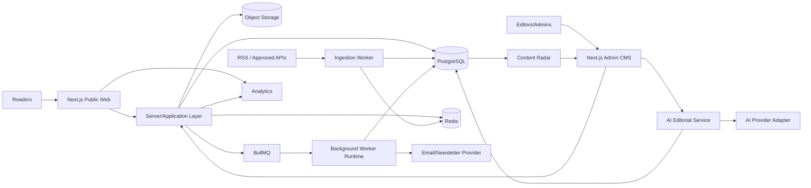
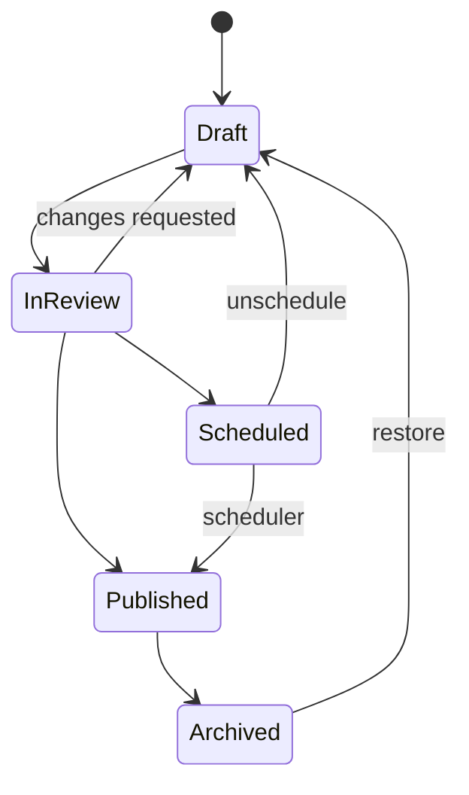
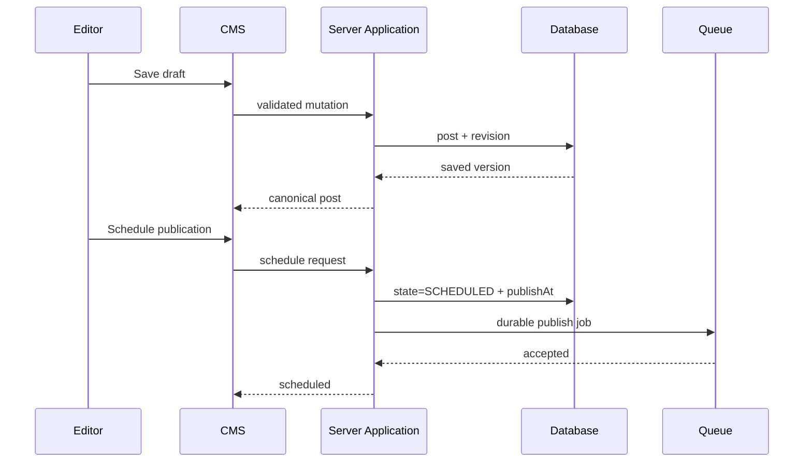
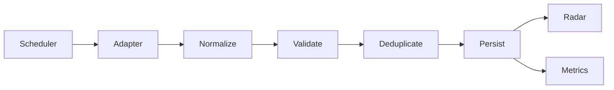
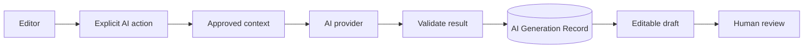

# 🏗️ The Living Journal — Architecture

> **Accepted production direction:** Next.js App Router + TypeScript + PostgreSQL/Prisma, with Redis/BullMQ introduced for durable background workflows when required. See [`docs/adr/ADR-001-nextjs-production-architecture.md`](adr/ADR-001-nextjs-production-architecture.md).

V2.1 remains the visual/reference frontend baseline while Phase 0 migrates the runtime without redesigning the product.

## 1. Architecture principles

- Human-controlled editorial publishing.
- Clear separation between public reading, editorial CMS, ingestion, AI and monetization.
- Backend owns authorization, publishing transitions and durable data.
- Background work is durable/retryable.
- External providers sit behind adapters so they can be changed.
- Public pages prioritize SEO, accessibility and performance.
- Documentation changes ship with architecture/workflow changes.
- Next.js is one deployment/application boundary, **not** permission to mix client/server concerns.

## 2. Target system



## 3. Accepted production stack

### Application/runtime
- **Next.js App Router**
- TypeScript
- React
- Existing CSS token/global/polish layers during migration
- GSAP + ScrollTrigger only in explicit client components

### Data/application services
- **PostgreSQL** — canonical durable datastore
- **Prisma** — schema, migrations and typed DB access
- **Redis** — caching/rate limits/job support when required
- **BullMQ** — required before durable ingestion, scheduled publishing and campaign workflows

### Provider boundaries
- S3-compatible storage / Cloudinary adapter for production media
- Resend or dedicated newsletter provider behind an email adapter
- AI provider behind a server-only adapter with usage logging
- Analytics provider behind a thin event interface
- RSS/API source adapters normalized into internal source models

### Why there is no NestJS service now
A separate NestJS API was considered but rejected for the initial production architecture. It would add auth/CORS/deployment/DTO complexity while still requiring an SSR strategy for the public publication. Service extraction remains possible later through a new ADR if scale/team boundaries justify it.

## 4. Repository direction

Phase 0 migration target:

```text
/
├── docs/
│   ├── adr/
│   ├── PRD.md
│   ├── ARCHITECTURE.md
│   ├── ROADMAP.md
│   └── PHASE-0-MIGRATION-PLAN.md
├── prisma/
│   └── schema.prisma
├── public/
├── src/
│   ├── app/                    # Next.js route tree/layouts
│   ├── components/             # reusable UI
│   ├── screens/                # retained during migration where useful
│   ├── features/               # introduced as real domains arrive
│   ├── server/
│   │   ├── db/
│   │   ├── services/
│   │   ├── auth/               # Phase 1
│   │   ├── jobs/
│   │   └── adapters/
│   ├── styles/
│   ├── lib/
│   └── types/
└── README.md
```

Do not move files merely to make the tree look cleaner. Preserve working V2.1 components first; refactor only when a production boundary benefits.

## 5. Server/client boundary

Default to server-rendered components/routes for public content and metadata. Use client components only for interactive/browser-dependent behavior such as:

- GSAP/ScrollTrigger
- mobile menu state
- local interactive search/filter behavior where appropriate
- temporary V2.1 `localStorage` demo flows during migration
- form interactivity

Rules:
- Database/provider secrets never enter client modules.
- `window`, `document`, `matchMedia`, `localStorage` and GSAP browser APIs must not run during server evaluation.
- Provider/database modules should be explicitly server-only.

## 6. Publishing architecture

### State machine



Server-side service methods own transitions. The UI requests transitions; it does not decide authorization.

### Story write path



## 7. Content Radar architecture

Every source adapter normalizes to an internal contract rather than leaking provider response shapes into the product:

```ts
interface NormalizedSourceItem {
  externalId?: string
  sourceId: string
  canonicalUrl: string
  title: string
  summary?: string
  author?: string
  publishedAt?: Date
  discoveredAt: Date
  imageUrl?: string
  categories?: string[]
  rawFingerprint: string
}
```



Failed source runs record error metadata and retry according to policy. No source item is public content by itself.

## 8. AI architecture

AI is an explicit editorial service, not an autonomous publisher.



Store provider/model, action type, timestamps, usage/cost where available and linkage to the relevant post/source item. Provider keys remain server-side.

## 9. Authentication & authorization

Initial roles:

| Capability | ADMIN | EDITOR |
|---|---:|---:|
| Read CMS | ✅ | ✅ |
| Create/edit drafts | ✅ | ✅ |
| Review/publish | ✅ | ✅ |
| Manage sources | ✅ | Optional |
| Manage monetization | ✅ | ❌ |
| Manage users/settings | ✅ | ❌ |

Authorization is checked on the server for every protected mutation. Hiding a button is not authorization.

## 10. Data boundaries

- **Post** — first-party publication content.
- **SourceItem** — third-party discovery/research metadata.
- **PostSource** — attribution/research relationship.
- **AiGeneration** — assistance record, not canonical content.
- **PostRevision** — editorial history.
- **Subscriber** — protected audience data.
- Monetization records should remain separate from article body blocks where practical.

## 11. Media

Production uploads use authorized persistent object storage. Store dimensions, MIME type, alt text, attribution and storage key. Never persist temporary browser object URLs as publication assets.

## 12. SEO rendering

Next.js public routes provide the production rendering boundary for:

Per story:
- canonical URL
- title/meta description
- Open Graph/Twitter metadata
- Article structured data
- breadcrumbs where appropriate
- indexability controls

Site level:
- dynamic sitemap
- RSS
- robots rules
- redirects for changed slugs

Dynamic production SEO is implemented in Phase 5; Phase 0 only establishes the runtime needed for it.

## 13. Jobs & reliability

Use durable jobs for:
- source ingestion
- scheduled publishing
- newsletter sends
- expensive asynchronous AI work if needed
- provider/analytics synchronization

Important jobs need idempotency/stable IDs, recorded attempts/failures and admin visibility. Persistent workers must run in a worker-capable runtime rather than being assumed to live indefinitely inside a serverless request.

## 14. Security baseline

- Secrets only in environment/secret manager.
- Server-side schema validation.
- Secure session cookies when auth arrives.
- CSRF protection where applicable.
- Rate limiting for auth/forms/AI.
- Sanitized rich text.
- Strict upload validation.
- Least-privilege provider credentials.
- Audit important admin actions.
- Never commit `.env` files.

## 15. Observability

At minimum capture:
- application errors
- ingestion success/failure/duration
- queue failures
- publish failures
- email failures
- AI provider failures/usage
- web vitals/public performance

## 16. Phase 0 implementation source of truth

Follow [`PHASE-0-MIGRATION-PLAN.md`](PHASE-0-MIGRATION-PLAN.md) for migration order and gates.

## 17. Documentation rule

Every material change updates documentation in the same branch/commit when applicable:

- User/setup/workflow → `README.md`
- Architecture/provider/data/security decision → `ARCHITECTURE.md` and ADR when architectural
- Product scope → `PRD.md`
- Phase completion/status → `ROADMAP.md` + README

This applies to human contributors and AI coding agents.
