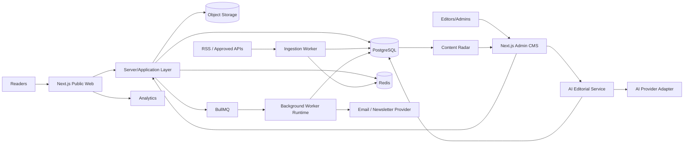
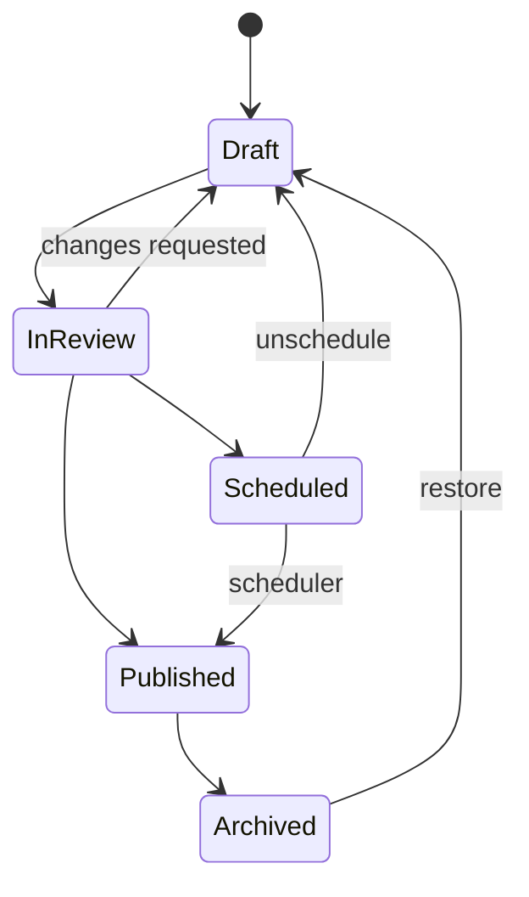
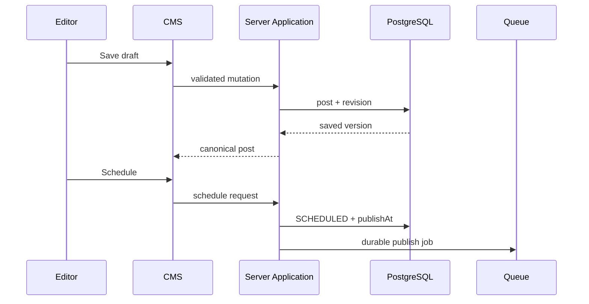
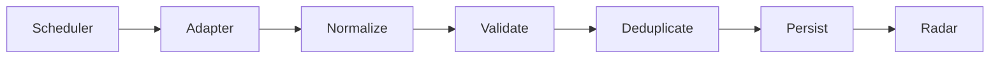
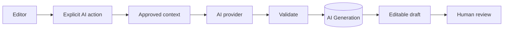

# 🏗️ The Living Journal — Architecture

> **Accepted and active application direction:** Next.js App Router + TypeScript, followed by PostgreSQL/Prisma, with Redis/BullMQ introduced for durable background workflows when required. See [`docs/adr/ADR-001-nextjs-production-architecture.md`](adr/ADR-001-nextjs-production-architecture.md).

The V2.1 visual system remains the UI reference. Phase 0 changes runtime/infrastructure boundaries without redesigning the publication.

## 1. Current implementation checkpoint

The repository has now moved from Vite/React Router to **Next.js App Router**.

Implemented in the active runtime:
- App Router public/admin route tree;
- `next/link` / `next/navigation` replacing React Router;
- root layout and metadata foundation;
- initial per-story metadata from seed content;
- explicit client boundaries for browser-dependent interaction;
- hydration-safe localStorage demo initialization;
- GSAP/ScrollTrigger retained inside a client component with cleanup;
- `GET /api/health` runtime health endpoint;
- Vite entry/config removed.

Not implemented yet:
- PostgreSQL/Prisma runtime;
- server-side production content persistence;
- auth/RBAC;
- Redis/BullMQ runtime;
- production provider integrations.

## 2. Architecture principles

- Human-controlled editorial publishing.
- Clear separation between public reading, CMS, ingestion, AI and monetization.
- Server/application layer owns authorization, publishing transitions and durable data.
- Background work requiring reliability is durable/retryable.
- External providers live behind adapters.
- Public pages prioritize SEO, accessibility and performance.
- Documentation changes ship with workflow/architecture changes.
- One Next.js application boundary does **not** mean client/server concerns may be mixed.

## 3. Target system



## 4. Accepted stack

### Active application runtime
- **Next.js App Router**
- React 19
- TypeScript
- existing `tokens.css` + `global.css` + `polish.css`
- GSAP + ScrollTrigger for client-only storytelling motion

### Next production-data foundation
- **PostgreSQL** — canonical durable datastore
- **Prisma** — schema/migrations/typed DB access

### Durable workflow foundation
- **Redis** — cache/rate limits/job infrastructure when needed
- **BullMQ** — required before durable ingestion, scheduled publishing and campaign jobs

### Provider boundaries
- S3-compatible storage / Cloudinary adapter for media
- email/newsletter provider behind an adapter
- AI provider behind a server-only adapter with usage logging
- analytics behind a thin event interface
- RSS/API adapters normalize external data into internal models

### Why no NestJS service initially
A separate NestJS API would add deployment, CORS, session/auth and DTO duplication while the publication still needs a server-rendered web runtime. If future scale/team ownership requires services, that must be documented in a new ADR.

## 5. Active repository shape

```text
/
├── docs/
│   ├── adr/
│   ├── PRD.md
│   ├── ARCHITECTURE.md
│   ├── ROADMAP.md
│   └── PHASE-0-MIGRATION-PLAN.md
├── public/
├── src/
│   ├── app/                    # active Next.js App Router
│   │   ├── (public)/
│   │   ├── admin/
│   │   ├── api/health/
│   │   ├── layout.tsx
│   │   └── not-found.tsx
│   ├── components/
│   ├── screens/                # V2.1 UI retained/reused
│   ├── content/
│   ├── context/                # temporary local demo content state
│   ├── hooks/
│   ├── styles/
│   ├── types/
│   └── utils/
├── next.config.ts
├── tsconfig.json
├── .env.example
└── README.md
```

Later Phase 0/production work may introduce `prisma/`, `src/server/`, `src/features/` or worker modules only when real boundaries need them. Do not reorganize working UI merely for aesthetics.

## 6. Server/client boundary

Prefer server-rendered routes/components for public content and metadata as canonical data moves server-side. Use client components only for behavior that genuinely needs the browser, including:

- GSAP/ScrollTrigger;
- mobile menu state;
- temporary interactive archive/search filtering;
- temporary V2.1 localStorage demo flows;
- form interaction/admin demo state.

Current migration rules:
- browser storage is loaded only after mount so the initial server/client render remains deterministic;
- `window`, `document`, `localStorage`, `matchMedia` and GSAP may not execute in server-evaluated code;
- database/provider/secrets code will be explicitly server-side;
- UI-only hiding is never authorization.

## 7. Routing & metadata

The active App Router maps:

```text
/
/stories
/stories/[slug]
/category/[slug]
/search
/newsletter
/about
/contact
/advertise
/legal/[page]
/admin
/admin/posts
/admin/posts/new
/admin/posts/[id]/edit
/admin/audience
/admin/settings
/api/health
```

Root metadata is provided through `src/app/layout.tsx`. Story routes currently generate seed-backed metadata as a migration scaffold. Production canonical SEO sourced from the database remains Phase 5.

## 8. Publishing architecture



Server-side application services will own transitions. The CMS requests transitions; it does not authorize itself.

### Planned write path



## 9. Content Radar boundary

Every external provider must normalize into an internal source contract rather than leaking provider response shapes through the product.

```ts
interface NormalizedSourceItem {
  externalId?: string
  sourceId: string
  canonicalUrl: string
  title: string
  summary?: string
  author?: string
  publishedAt?: Date
  discoveredAt: Date
  imageUrl?: string
  categories?: string[]
  rawFingerprint: string
}
```



A source item is a research lead, never public content by itself.

## 10. AI boundary



AI remains server-mediated and cannot directly publish.

## 11. Authentication & authorization — Phase 1

Initial roles:

| Capability | ADMIN | EDITOR |
|---|---:|---:|
| Read CMS | ✅ | ✅ |
| Create/edit drafts | ✅ | ✅ |
| Review/publish | ✅ | ✅ |
| Manage sources | ✅ | Optional |
| Manage monetization | ✅ | ❌ |
| Manage users/settings | ✅ | ❌ |

All protected mutation authorization will be server-side.

## 12. Data boundaries

- **Post** — first-party publication content
- **SourceItem** — third-party discovery/research metadata
- **PostSource** — attribution relationship
- **AiGeneration** — assistance/usage record
- **PostRevision** — editorial history
- **Subscriber** — protected audience data
- monetization records separated from article content where practical

## 13. Media

Production media will use authorized persistent object storage, recording MIME type, dimensions, alt text, attribution and storage key. Browser object URLs are not durable publication assets.

## 14. SEO

Next.js is now the rendering foundation for canonical metadata, article structured data, sitemaps, RSS and redirects. Phase 0 establishes capability; Phase 5 connects those outputs to canonical database content and search-distribution policy.

## 15. Jobs & reliability

Durable jobs are required for source ingestion, scheduled publishing, newsletter sends and other retry-sensitive work. Important jobs need stable IDs/idempotency, attempts/failure records and worker-capable runtime placement.

## 16. Security baseline

- secrets only in environment/secret manager;
- server-side input validation;
- secure sessions when auth arrives;
- CSRF protection where applicable;
- rate limiting for sensitive/expensive endpoints;
- sanitized rich content;
- upload validation;
- least-privilege credentials;
- audit important admin actions;
- never commit real `.env` secrets.

## 17. Observability

Eventually capture application errors, ingestion/job failures, publishing failures, email failures, AI usage/failures and public performance metrics.

## 18. Phase 0 source of truth

Follow [`PHASE-0-MIGRATION-PLAN.md`](PHASE-0-MIGRATION-PLAN.md). The immediate gate is local verification of the Next.js migration/client boundaries, followed by PostgreSQL/Prisma foundation work.

## 19. Documentation rule

Update documentation in the same change when setup, routes, workflows, architecture, product scope or phase status change. This applies equally to human contributors and AI coding agents.
